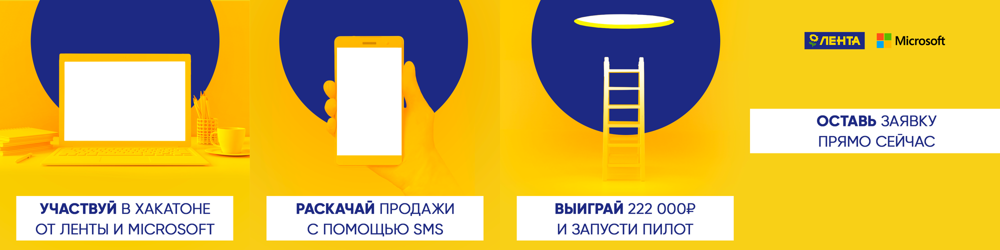
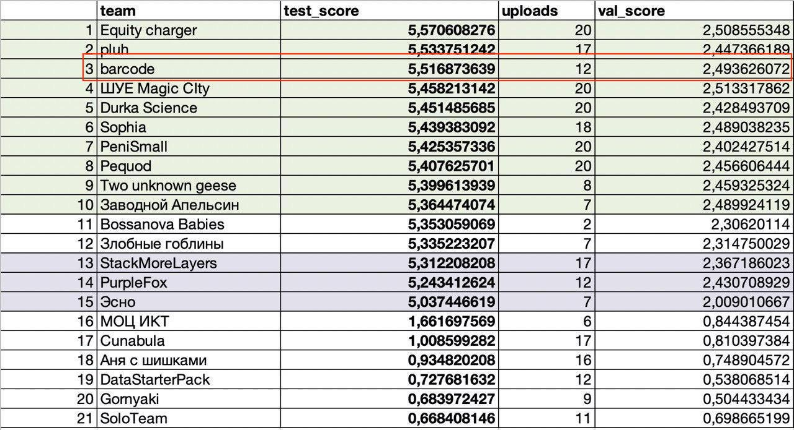

# Решение хакатона BigTarget

  

# Решение

Наша команда разработала и построила Uplift модель на агрегированных данных Ленты.

Также реализовали MVP, которое доступно по адресу: [https://kurochkinsergei.github.io/bigtarget_barcode/](https://kurochkinsergei.github.io/bigtarget_barcode/)

# Презентация

Слайды презентации доступны по ссылке: [презентация](./barcode_presentation_extra_compressed.pdf).

# Команда

* [Максим Шевченко](https://github.com/maks-sh) Data Scientist

* [Ирина Елисова](https://github.com/ElisovaIra) Data Scientist

* [Сергей Курочкин](https://github.com/kurochkinSergei) Front-end developer

* [Кирилл Ликсаков](https://github.com/kirrlix1994) Data Scientist

# Leaderboard

  

